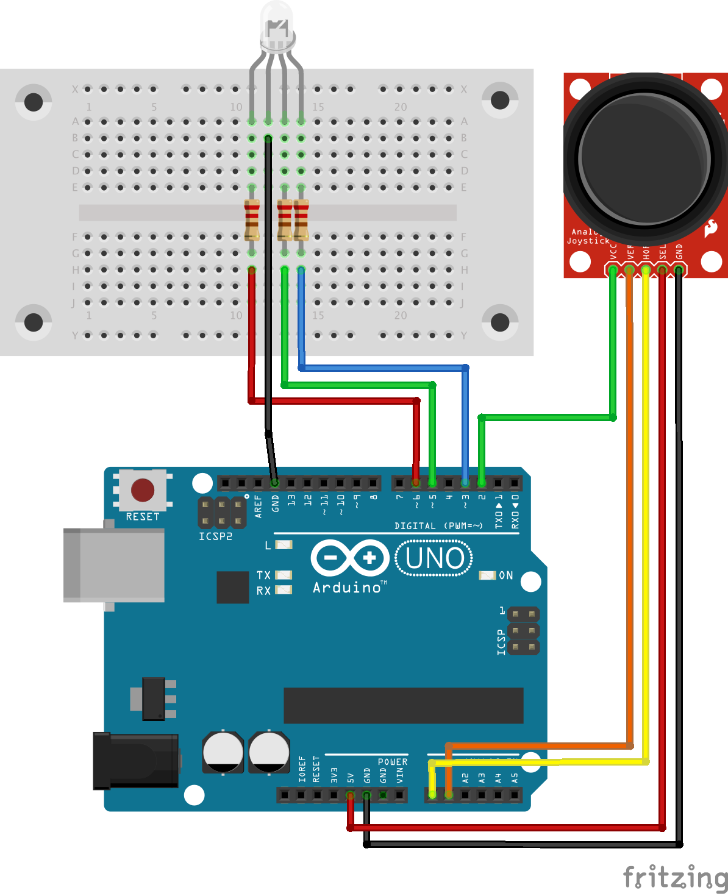

# rainbow-arduino

Simple project to learn the initial Arduino concepts.

In this project, by moving the joystick around the RGB LED change it's colors. Additionally, the Arduino
sends its on/off state and the current color with a simple string-based protocol on the serial port.

The node.js server picks that up and renders similar colors in the terminal.

